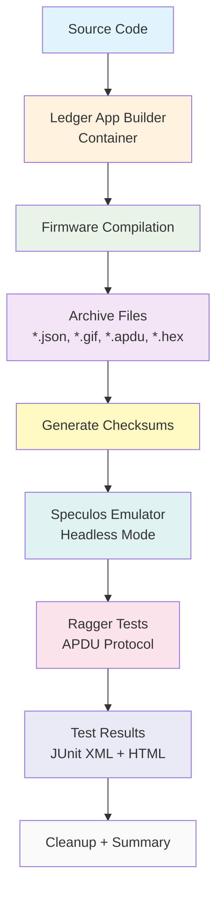

# Local CI Simulation for Tari Ledger Wallet

## Overview

This directory provides a local simulation of the GitHub Actions CI workflow for testing the Tari Ledger Wallet application. The simulation allows you to test the complete build and test process locally before pushing changes to the repository.

## Quick Start

### Prerequisites

- **Podman**: Container runtime (install with your package manager)
- **Python 3.10+**: For running Ragger tests

### First-Time Setup

1. **Install Python dependencies:**
   ```bash
   pip install -r ../requirements.txt
   pip install speculos
   ```

2. **Pull required container images:**
   ```bash
   podman pull ghcr.io/ledgerhq/ledger-app-builder/ledger-app-builder:latest
   podman pull ghcr.io/ledgerhq/speculos:latest
   ```

### Running the Simulation

**Basic usage (Nano S Plus device - default):**
```bash
./simulate_ci_podman.sh
```

**Specific device testing:**
```bash
./simulate_ci_podman.sh nanosplus nanosp    # Nano S Plus
./simulate_ci_podman.sh nanox nanox         # Nano X
./simulate_ci_podman.sh stax stax           # Stax
./simulate_ci_podman.sh flex flex           # Flex
```

## Command Parameters

The script accepts two parameters:
```bash
./simulate_ci_podman.sh [LEDGER_TARGET] [SPECULOS_MODEL]
```

**Parameter explanation:**
- **`LEDGER_TARGET`**: Device to compile firmware for (nanosplus, nanox, stax, flex)
- **`SPECULOS_MODEL`**: Device model to emulate for testing (nanosp, nanox, stax, flex)

**Default values (when no parameters provided):**
- `LEDGER_TARGET`: `nanosplus`
- `SPECULOS_MODEL`: `nanosp`

## What the Simulation Does

The script replicates the complete GitHub Actions workflow:

1. **Builds** the Ledger wallet firmware using the official builder container
2. **Starts** a Speculos emulator for the target device
3. **Runs** Ragger tests against the emulated device
4. **Generates** test reports and summaries

## Expected Output

After successful execution, you should see:
- ✅ Firmware compilation success message (takes ~12 seconds)
- ✅ Speculos emulator startup confirmation
- ✅ Test execution results (6/6 tests should pass in ~4 seconds)
- ✅ Cleanup and summary generation

## Troubleshooting

### Common Issues

**Podman not running:**
```bash
systemctl --user start podman.socket
```

**Missing dependencies:**
```bash
# Install all required Python packages
pip install -r ../requirements.txt
pip install speculos
```

**Debug mode:**
```bash
bash -x ./simulate_ci_podman.sh nanosplus nanosp
```

**Permission issues:**
```bash
# Ensure you're in the project root directory
cd /data/git/tari
```

## Best Practices

- Run the simulation before pushing changes to ensure CI compatibility
- Check generated logs in `tests/ledger_wallet/logs/` for detailed information
- The script automatically cleans up containers after execution
- Total execution time should be around 20-30 seconds

## Architecture and Workflow

### Workflow Diagram



### CI Artifact Simulation

The simulation replicates the exact GitHub Actions artifact creation process. When the CI workflow runs successfully, these same files are packaged into downloadable ZIP archives:

**Files included in both simulation and CI artifacts:**
- `*.json` - Application metadata (app_nanosplus.json, app_flex.json)
- `key*.gif` - Device icons (key_14x14.gif, key_40x40.gif)  
- `minotari_ledger_wallet.*` - Binaries and installation files

**Purpose of artifact simulation:**
- Validates that all distribution-ready files are generated
- Creates checksums for integrity verification
- Mirrors the exact structure used in production CI

### Integration with GitHub Actions

This simulation closely matches the `build_ledger_wallet_testing.yml` workflow. The key differences are:

- **Local execution**: Uses Podman instead of GitHub Actions runner
- **Manual triggering**: No automatic triggers or schedules  
- **Artifact handling**: Local file system instead of GitHub artifacts
- **Same file structure**: Identical files and checksum generation

## Related Documentation

For detailed information about the testing framework, see:
- `../README.md` - Main testing framework documentation
- `../RAGGER_USAGE.md` - Ragger testing framework guide
